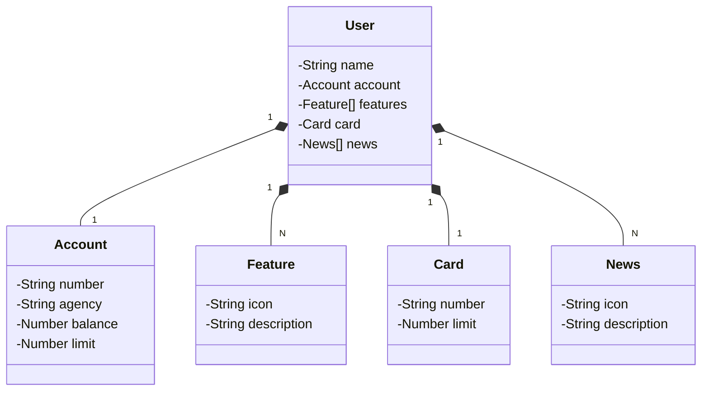

# Santander Dev Week 2023

Java RESTful API criada para a Santander Dev Week.

## Principais Tecnologias
 - **Java 17**
 - **Spring Boot 3**
 - **Spring Data JPA** 
 - **OpenAPI (Swagger)**
 - **Railway** 

## Diagrama de Classes (Domínio da API)


<br>

## Configuração h2

```
spring:
  datasource:
    url: jdbc:h2:mem:sdw2023
    username: sdw2023
    password:
  jpa:
    show-sql: true
    open-in-view: false
    hibernate:
      ddl-auto: create # validate | update | create | create-drop
    properties:
      hibernate:
        format_sql: true
  h2:
    console:
      enabled: true
      path: /h2-console
      settings:
        trace: false
        web-allow-others: false   
```
<br>
 
 ## Configuração Postgres

```
 datasource:
    url: jdbc:postgresql://${PGHOST}:${PGPORT}/${PGDATABASE}
    username: ${PGUSER}
    password: ${PGPASSWORD}
```
<br>

## IMPORTANTE

Este projeto foi construído como desafio de projeto para a DIO.  

 
